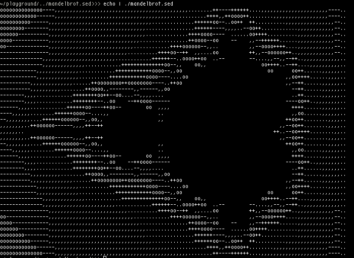

# mandelbrot.sed

A sed script that renders Mandelbrot set in ascii. Uses unary arithmetic extended with negative numbers to do all computations.

Run with `$ echo | ./mandelbrot.sed`

## How it works

### Arithmetic

Since sed can't manipulate numbers in any "standard" way, I have to represent them in unary (as strings of 'a's, 'aaa' being a representation of 3). The negative numbers are represented by adding '-' before the string. 

All numbers are treated as numerators of a fraction with a fixed denominator N. That doesn't affect addition, but requires an additional step for multiplication (as A/N * B/N is A\*B/N\^2, while straightforward multiplication produces A\*B/N, with denominator N being assumed).

Addition and substraction is done by grouping together numbers with same signs and then cancelling out unary digits on the sides of '-':

    aaa-aa
    aa-a
    a-
   
(final '-' is dropped afterwards).

The multiplication operation is performed by repeated copying of one number while decrementing another one. To avoid slowdown, division is performed at the same. It is done by replacing strings of 'a' longer than N with a different character, that is after converted back into an 'a'. After multiplication and division is done, we are left with a result value and remaining 'a's. The value is rounded up if number of leftover 'a's is more or equal than N/2.

Preliminary explanation available [here](https://www.reddit.com/r/commandline/comments/j5uqvp/a_sed_script_that_renders_mandelbrot_set/g7ux5zw/).
